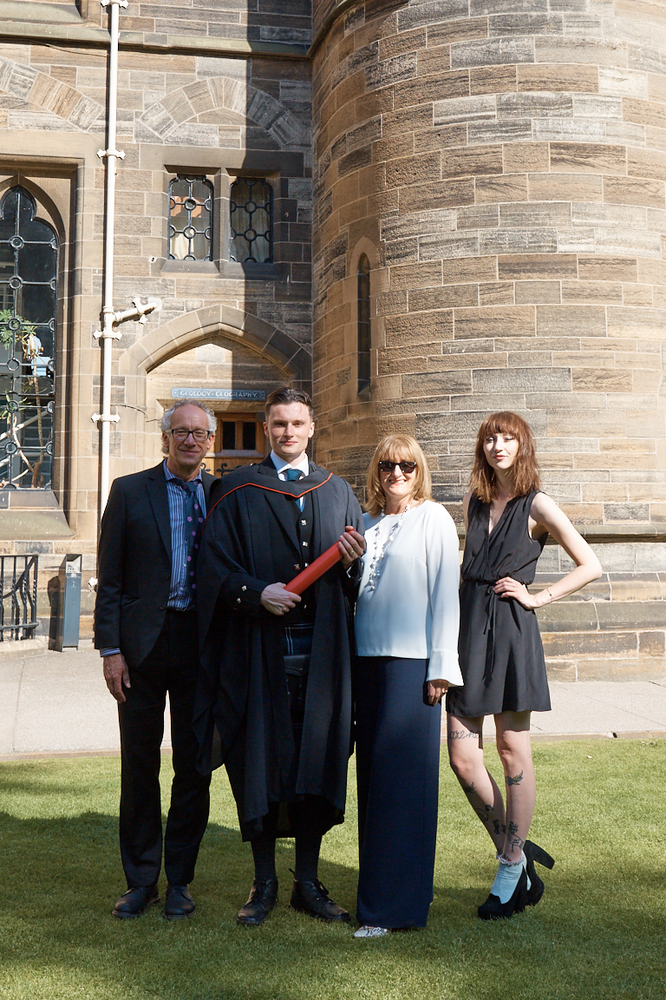

#### Research Methods of Psychological Science MSc
##### University of Glasgow
##### September 2018 - September 2019
I am currently studying the Research Methods MSc course at the University of Glasgow. My project is supervised by Dr. Christoph Scheepers and is investigating genre-specific language processing, you can read more about this in the [Research sectin](research.html)

This course will further develop my research credentials by learning specific practical methods as well improving my skills in terms of coding and data analysis.

  
  Interesting Fact: Both of my parents and my older sister also have Psychology degrees from the University of Glasgow.

#### Psychology BSc
##### University of Glasgow
###### September 2013 - June 2018
I completed my undergraduate degree in June 2018, I achieved an upper 2:1 degree. I picked up key skills during my undergraduate, especially in the final 2 years. Primary amongst these was the improvement in my analytical thinking and computer literacy skills. I had never previously had experience of coding but achieved A2 grades in both 3rd year Statistics and 4th Advanced Statistics courses. 

The process of my dissertation was also a very useful experience, working on a piece of research from the very start was a learning curve and one I am very grateful for.

I had originally started a Maths degree but switched to Psychology in 2nd year and it was the best decision I have ever made.

#### St. Ninian's High School, East Renfrewshire
##### August 2007 - May 2013
I left high school with 5 As and 1 B at Higher and 1 C at Advanced Higher. I enjoyed my time at school and tended to do well in exams. My maths teacher in 5th year was very engaging and he really made me like the subject. Given my aptitude for the subject, I decided to pursue it as a career path. I intended to study Actuarial Science which is why I originally took Maths at university.

One of my big regrets from school was not taking a language class, I was more interested in the sciences but now see how valuable being able to speak a second language is.

