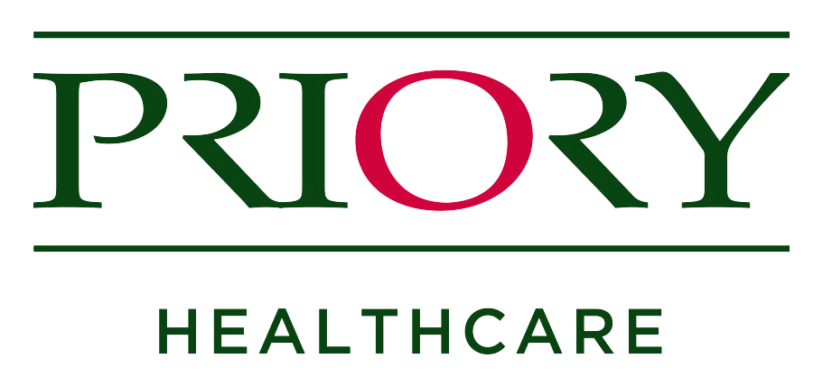

  

## The Priory Hospital, Glasgow
[The Priory](https://www.priorygroup.com/locations/priory-hospital-glasgow) is a private mental healthcare centre primarily dealing with addictions, depression, anxiety and eating disorders. I have worked there for around a year and a half and have built a strong foundation of clinical experience in my time there, as well as being closely involved in an NHS research project.

#### Work Experience
Halfway through 3rd year of my undergraduate degree, I decided I wanted to pursue Clinical Psychology. In order to explore this possibility, I organised a month-long work placement at the Priory Hospital, which begain in May 2017. I knew the placement would either cement my ambition to work in mental health or put me off the idea and I'm glad to say it was the former that prevailed. 

The placement provided me with my first experience of a clinical environment, I gained a good understanding of mental health care and the role of the clinical psychologist. My placement was mostly spent between Observation of the addiction therapy groups and joining the clinical psychologist in the eating disorder multi-dsiciplinary team meetings. The addiction therapy groups allowed me to see the various evidence-based approaches available to therapists and how different methods are effective for different types of patients. Seeing the effective communication between health professionals in the eating disorder MDT meetings impressed upon me the importance of collaborative decision-making when considering the care of the patients.

#### Healthcare Assistant
After my work placement I joined the Priory as a bank healthcare assistant. This HCA role has given me an excellent foundation of clinical experience across different populations. I can confidently carry out a range of clinical duties such as observations (at all levels from general to Level 4 2:1) as well as more ward-specific tasks like drug-testing in addictions and nasogastric feed restraint in ED. 

The Priory supply training courses to give a theoretical basis to the skills as well as providing an opportunity to hone the practical elements aswell. Thus I have training in areas such as Violence & Aggression Management, Basic Life Skills and Safeguarding. As part of the role, I have experience of supervision and know that this area of work can be stressful but I&#39;m aware of the support systems in place to help.

#### Research Assistant
I am also involved in an NHS Tayside study of alcohol abuse disorders. I hold the role of Research Assistant and collect data from appropriate Priory service users. This has given me a lot of confidence in approaching clinical groups in a research capacity. More about the study itself can be found in the [Research section](research.html)

