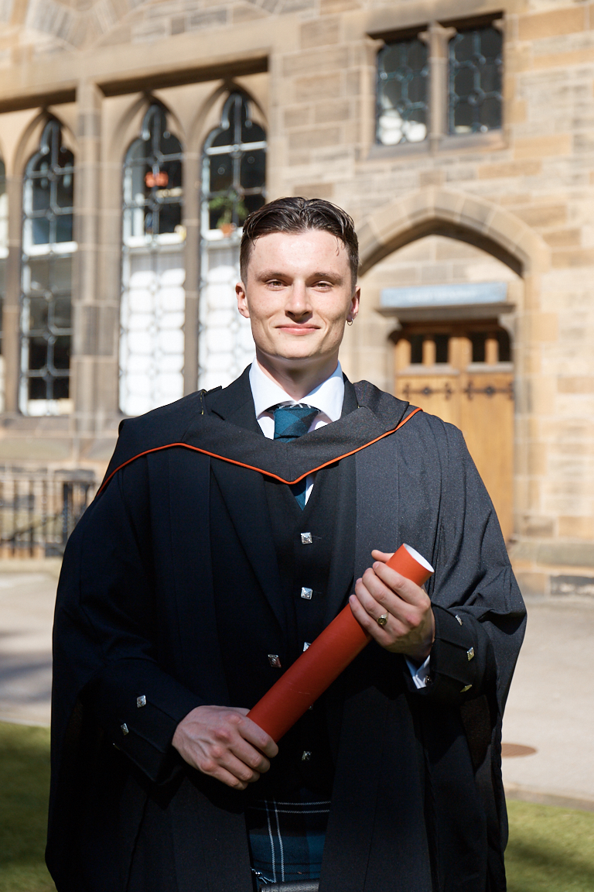

  

I am a postgraduate student at the University of Glasgow's
[Institute of Neuroscience and Psychology](http://www.gla.ac.uk/researchinstitutes/neurosciencepsychology/). I am currently enrolled on the Research Methods of Psychological Science MSc after graduating from my Psychology BSc degree earlier in 2018, you can read more about this on my [Education page](edu.html).

For my Masters project, I am working with [Dr. Christoph Scheepers](https://www.gla.ac.uk/researchinstitutes/neurosciencepsychology/staff/christophscheepers/), more information about this project can be found in the [Research section](research.html).

Since May 2017, I have been working at [the Priory Hospital Glasgow](https://www.priorygroup.com/locations/priory-hospital-glasgow), where I hold two roles; Healthcare Assistant and Research Assistant. You can read more about my time at the Priory in the [Experience section](exp.html) of the website.

You can find out more about my life outside of Psychology on the [Other Interests](int.html) page.

