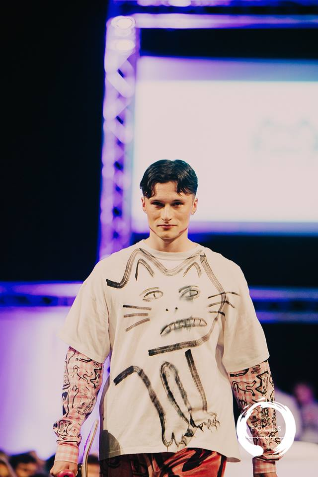
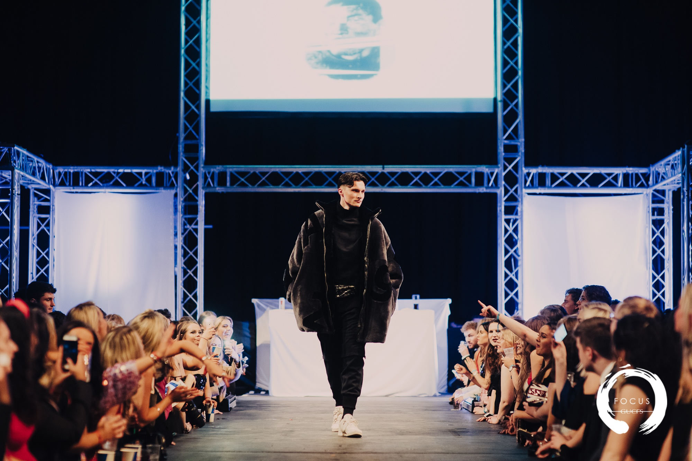

  
  Wearing Hannah McIvor at GUCFS Feb 2018 at SWG3

I have a keen interest in TV and film and regularly attend the Glasgow Film Theatre. In October 2018, I had a review of the Netflix series &#39;Maniac&#39; published online by the BPS magazine, The Psychologist. The review considers the series&#39; message of the ever-present need for human involvement in therapy despite being set in a fictional world of huge technological and pharmaceutical advancement.
You can read my review [here](https://thepsychologist.bps.org.uk/traversing-minefield-cliches).

I enjoy keeping fit by going to the gym and playing in a 7-a-side football league with friends from university. I am also a big football fan and have had a season ticket for Dunfermline Athletic Football club since I was a young boy. I travel to games with my dad and we have seen our fair share of highs and lows over the years.

I&#39;m an active member of the [Glasgow University Charity Fashion Show](https://gucfs.co.uk/). The society fundraises each year for a different charity. Throughout the year, there are various fundraising ventures, such as the sponsored swim-a-thon last year, as well as photoshoots which feature different graduate designers. The year leads up to the showpiece event in February when we put on a fashion show at the exciting Glasgow location, SWG3. 

My role is to model the clothes in the photoshoots and on the night of the show I get to wear interesting pieces on the walkway. We raised &pound;15,000 for the [Scottish Association of Mental Health](https://www.samh.org.uk/) in 2016/17 and &pound;23,000 for [Glasgow Children&#39;s Hospital Charity](https://www.glasgowchildrenshospitalcharity.org/) last year. This year we are raising money for [Simon Community](https://www.simonscotland.org/), which is a charity fighting homelessness in Glasgow.

  
    Wearing Lou Lou Hicks at GUCFS Feb 2018 at SWG3

